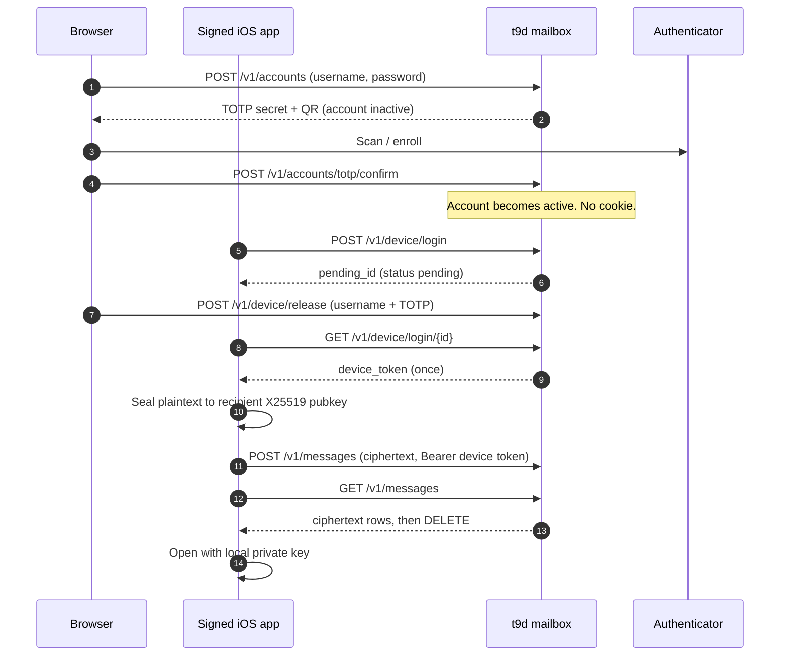

# T-9

**Fetch-once messaging. Pure privacy but feels like SMS.** Self-host a blind Go mailbox. Ciphertext lives only on a signed iOS app. Browsers can create accounts, enroll TOTP, and release a pending device login — they never receive a mailbox session.

T-9 is a same-server, no-PII messenger for people who want short sealed notes that disappear from the host after they are read. It is not a social network, not a webmail client, and not a multi-device chat platform.

| Rule | Meaning |
|------|---------|
| **160 graphemes** | Hard cap per message (Unicode extended grapheme clusters) |
| **Fetch-once** | `GET /v1/messages` returns ciphertext and deletes it |
| **24h TTL** | Unfetched mail is purged after one day |
| **One device** | One bound app session per account |
| **No web login** | No account cookies, no browser inbox |
| **No PII** | Opaque username, never email or phone |
| **Physical QR contacts** | Address book stays on the device |
| **Sealed disk** | SQLite at rest is AES-GCM wrapped with `T9_DB_KEY` |

Wire format and crypto details: [docs/PROTOCOL.md](docs/PROTOCOL.md). Adversaries and non-goals: [docs/THREAT_MODEL.md](docs/THREAT_MODEL.md). Feature-level maintainer docs: [docs/knowledge-base/index.md](docs/knowledge-base/index.md).

---

## Contents

- [Why T-9 exists](#why-t-9-exists)
- [How a message travels](#how-a-message-travels)
- [Quick start](#quick-start)
- [User journey](#user-journey)
- [Architecture](#architecture)
- [HTTP API](#http-api)
- [Configuration](#configuration)
- [Deployment](#deployment)
- [iOS client](#ios-client)
- [Security model](#security-model)
- [Development](#development)
- [Limitations (MVP)](#limitations-mvp)
- [Documentation map](#documentation-map)
- [License](#license)

---

## Why T-9 exists

Most messengers keep history on a server, accept email or phone as identity, and treat the browser as a first-class client. T-9 inverts those defaults:

1. **The server is a mailbox, not a reader.** It stores opaque ciphertext plus delivery metadata (who → whom, size, time). Private keys never leave the device.
2. **Password theft is not enough to bind a mailbox.** Device login stays `pending` until the account owner types username + a live TOTP code on the web release page.
3. **The browser is untrusted for mail.** Create, enroll, release, revoke. Never fetch. Responses always include `"session": null`, and `Set-Cookie` is stripped.
4. **Contacts are a physical act.** There is no server address book, no search, no invite email. You scan (or paste) a `t9://contact` QR in person.
5. **Mail does not accumulate.** Fetch deletes. Expiry deletes. There is no “archive on the host.”

If you need groups, media, push notifications, multi-device sync, or federation, this project is the wrong tool. Those are explicit MVP non-goals.

---

## How a message travels



Plaintext exists on sending and receiving devices. Between them, the server only sees bytes.

---

## Quick start

### Docker

```bash
cd deploy
cp .env.example .env   # optional overrides only
docker compose up --build
```

Open [http://127.0.0.1:8080/setup.html](http://127.0.0.1:8080/setup.html) on first boot. Enter the public base URL, generate a DB seal key, and optionally paste a Cloudflare Tunnel token. Settings are written to the Docker volume (`/data/t9.setup.json`, `/data/cloudflare.token`). The container exits and restarts into mailbox mode. No host file edits required.

Then open [http://127.0.0.1:8080](http://127.0.0.1:8080) → create a handle → scan the TOTP QR → confirm.

You can still set `T9_DB_KEY` / `T9_BASE_URL` in `.env` to skip the UI. If boot fails with a decrypt / authentication error, restore the original key, or wipe mailbox data once with `T9_RESET_DB=1 docker compose up --build` (then unset `T9_RESET_DB`).

### Local Go (dev)

Requires the Go toolchain declared in `server/go.mod` (Docker builds with Go 1.24+ and `GOTOOLCHAIN=auto`):

```bash
export T9_DB_KEY='dev-only-change-me!!'
export T9_DATA=./data
export T9_LISTEN=:8080
export T9_BASE_URL=http://127.0.0.1:8080
cd server && go run ./cmd/t9d
```

Tests: `cd server && go test ./...`

---

## User journey

### 1. Create (browser)

`POST /v1/accounts` stores an **inactive** row: Argon2id password hash + column-encrypted TOTP secret. The page shows a QR (`otpauth://`) generated server-side as a PNG data URL.

Until TOTP is confirmed, the username is not permanent:

- Re-creating the same handle replaces the unfinished enrollment
- **Cancel**, leaving the page (beacon), or `POST /v1/accounts/abandon` deletes it
- Background purge deletes inactive rows at `enroll_expires_at` (15 minutes)

Active accounts are never removed this way.

### 2. Bind a device (app + browser)

The iOS app sends username, password, a `device_id`, and a non-empty `assertion`. The server answers `202` with a `pending_id`. The app polls. The browser approves or denies with **username + TOTP only** (no password, no cookie).

On approve, the server:

1. Deletes any existing device session for that account (one device)
2. Mints a 32-byte device token, stores only its SHA-256 hash
3. Returns the plaintext token on the **next successful poll, once**

Mailbox routes require `Authorization: Bearer <device_token>`. A pending id used as a bearer token is `401`.

### 3. Exchange contacts (device only)

Each app shows a QR:

```
t9://contact?u=<username>&pk=<base64-x25519-pubkey>&srv=<server-fingerprint>
```

Scanning (MVP: paste the payload) writes a **local** contact. The server never stores the graph. A `srv` mismatch against `GET /v1/info`’s `fingerprint` is warned, not silently ignored.

### 4. Send and fetch

Composer seals UTF-8 plaintext to the recipient’s X25519 public key (ephemeral sender key + HKDF-SHA256 + AES-GCM, salt `t9-msg-v1`), then `POST /v1/messages`. Inbox `GET /v1/messages` is fetch-and-delete. Keep decrypted copies locally if you want history — the host will not.

---

## Architecture

```text
┌─────────────────────────────────────────────────────────────┐
│  Browser (untrusted for mail)                               │
│  /  create · /release.html  approve/deny · /status.html     │
└──────────────────────────────┬──────────────────────────────┘
                               │  no cookies, credentials: omit
┌──────────────────────────────▼──────────────────────────────┐
│  t9d  (Go, CGO-free)                                        │
│  api/  auth/  store/  crypto/  purge/  webembed/            │
│  sealed file: T9_DATA/t9.db.sealed                          │
│  working SQLite: T9_DATA/.t9.work.db  (process lifetime)    │
└──────────────────────────────┬──────────────────────────────┘
                               │  TLS at tunnel / reverse proxy
┌──────────────────────────────▼──────────────────────────────┐
│  Signed iOS app  (SwiftUI, iOS 17+)                         │
│  Keychain: X25519 identity + device token                   │
│  Local: contacts.json, kept-messages.json, optional backup  │
└─────────────────────────────────────────────────────────────┘
```

| Path | Role |
|------|------|
| `server/` | `t9d` HTTP API + embedded web UI |
| `web/` | Source for create / release / operator pages (copied into the binary) |
| `deploy/` | Dockerfile, Compose, optional `cloudflared` profile |
| `ios/` | SwiftUI MVP client |
| `docs/` | Protocol, threat model, knowledge base |
| `scripts/sync-web.sh` | Copy `web/` → `server/internal/webembed/static/` |

The Docker image copies `web/` into the embed tree at build time. For a local `go run`, run `scripts/sync-web.sh` after editing HTML/CSS/JS.

---

## HTTP API

All JSON APIs reject bodies that contain PII-shaped keys (`email`, `phone`, `phone_number`, `e_mail`, `mobile`, `legal_name`, `fullname`) with `400`.

| Method | Path | Who | Effect |
|--------|------|-----|--------|
| `GET` | `/v1/health` | public | Liveness |
| `GET` | `/v1/info` | public | Fingerprint, `base_url`, capability flags |
| `POST` | `/v1/accounts` | browser | Inactive account + TOTP material; `"session": null` |
| `POST` | `/v1/accounts/totp/confirm` | browser | Activate account |
| `POST` | `/v1/accounts/abandon` | browser | Delete inactive enrollment |
| `POST` | `/v1/device/login` | app | Create pending bind (`202`) |
| `GET` | `/v1/device/login/{id}` | app | Poll; device token issued **once** on approve |
| `POST` | `/v1/device/release` | browser | Approve or deny with TOTP |
| `POST` | `/v1/device/revoke` | app **or** browser | Bearer token, or username + TOTP |
| `POST` | `/v1/messages` | device token | Store ciphertext (max 4096 bytes, graphemes 1–160) |
| `GET` | `/v1/messages` | device token | Fetch and delete non-expired mail |

`GET /v1/info` advertises the product contract:

```json
{
  "name": "t9",
  "web_login": false,
  "pii": false,
  "fetch_once": true,
  "one_device": true,
  "max_graphemes": 160,
  "message_ttl_h": 24
}
```

Capability matrix:

| Action | Browser | Pending login | Device token |
|--------|---------|---------------|--------------|
| Create / TOTP / abandon | yes | — | — |
| Release / deny pending | yes (usr + TOTP) | — | — |
| Send / fetch ciphertext | no | no | yes |
| Read plaintext | never | never | only with local keys |

Full request shapes: [docs/PROTOCOL.md](docs/PROTOCOL.md) and [docs/knowledge-base/functionalities/](docs/knowledge-base/functionalities/).

---

## Configuration

| Variable | Required | Default | Notes |
|----------|----------|---------|--------|
| `T9_DB_KEY` | via UI or env | — | ≥16 chars. Prefer `/setup.html` (stored in volume). Keep stable. |
| `T9_LISTEN` | no | `:8080` | Bind address |
| `T9_DATA` | no | `./data` | Sealed DB + setup file (`/data` in Docker) |
| `T9_BASE_URL` | via UI or env | setup / `http://127.0.0.1:8080` | Public origin used in release URLs |
| `T9_RESET_DB` | no | unset | `1` / `true` / `yes` / `on` deletes sealed DB on boot |
| `T9_PORT` | Compose | `8080` | Host port mapping |
| `T9_APNS_*` | no | unset | Optional APNs HTTP/2 credentials for background push |
| Tunnel token | via UI | — | Pasted in setup → `/data/cloudflare.token` for `cloudflared` sidecar |

Hard-coded process timings (not env-tunable in this MVP):

- Pending device login TTL: **15 minutes**
- TOTP enrollment TTL: **15 minutes**
- Message TTL: **24 hours**
- Purge interval: **1 minute**
- Device token size: **32 random bytes** (stored hashed)

---

## Deployment

`t9d` speaks HTTP. Put TLS in front (Cloudflare Tunnel, Caddy, nginx, or another reverse proxy). The binary does not terminate HTTPS itself.

### Cloudflare Tunnel (no public IP)

1. In Zero Trust, create a tunnel: hostname → `http://t9:8080` on the Compose network.
2. Start Compose (`docker compose up --build`). Open `/setup.html`, set `T9_BASE_URL` to `https://your.hostname`, and paste the tunnel token.
3. The `cloudflared` sidecar waits for `/data/cloudflare.token` and connects automatically.

### Data and keys

Persistent volume: Compose `t9-data` → `/data`.

On disk when the process is **stopped**, operators should see `t9.db.sealed` (`T9DB1\n` + AES-256-GCM of the SQLite bytes) and a short `t9.db.keyfp` fingerprint of the master key. While `t9d` is **running**, a process-local `.t9.work.db` exists in plaintext so SQLite can work; it is removed on clean shutdown.

This is whole-file seal + TOTP column encryption in pure Go. It is **not** SQLCipher page encryption. A live host is still in scope for RAM / disk forensics. See [docs/knowledge-base/concepts/database-encryption.md](docs/knowledge-base/concepts/database-encryption.md).

---

## iOS client

Open `ios/T9.xcodeproj` in Xcode 15+ (iOS 17), set your Development Team, run on a device or simulator.

Screens: server URL → username/password → wait for web release → inbox / composer / QR contacts / settings (encrypted backup, revoke).

- Identity keys and the device token sit in Keychain
- Message crypto is CryptoKit X25519 + AES-GCM
- Live camera scan is stubbed; paste `t9://contact?…` payloads (AVFoundation belongs in a signed distribution build)
- App Attest is **not** implemented — `assertion` is the placeholder `t9-ios-mvp-signed-placeholder`
- Bundle id: `app.t9.messenger` (see `ios/project.yml`)

Optional: regenerate the Xcode project with [XcodeGen](https://github.com/yonaskolb/XcodeGen) from `ios/project.yml`.

More: [ios/README.md](ios/README.md) and [docs/knowledge-base/functionalities/contact-exchange.md](docs/knowledge-base/functionalities/contact-exchange.md).

---

## Security model

**Assets:** password verifier, TOTP secret, hashed device token, message ciphertext, client identity keys, local contact graph.

**Trust boundaries:**

1. **Browser** — untrusted for mailbox
2. **Signed iOS app** — keys + device token; only path to ciphertext APIs
3. **Server** — authz, TTL, fetch-once; must not learn plaintext
4. **Physical proximity** — QR contact exchange

Password theft alone cannot bind a mailbox. Stolen browser cookies cannot, because there are none. Disk theft of a powered-off host hits the sealed blob, not a raw SQLite header.

**Residual risks (MVP):** TOTP phishing on the release page; App Attest not enforced; working SQLite plaintext while the process is live; backup passphrase strength; metadata visible to the operator (who → whom, sizes, times). Traffic analysis hiding is a non-goal.

Read [docs/THREAT_MODEL.md](docs/THREAT_MODEL.md) before exposing a node.

---

## Development

```bash
# API + store + crypto tests
cd server && go test ./...

# Refresh embedded web assets after editing web/
./scripts/sync-web.sh
```

Integration tests assert, among other things:

- No `Set-Cookie` on account/release flows
- Mailbox rejects non-device tokens
- Pending ids cannot fetch until release
- Device token is one-shot on poll
- Fetch-once deletes
- Sealed DB lacks `SQLite format 3` without the key
- PII field names are rejected
- Unfinished TOTP enrollments release the username

There is **no telemetry** by design.

---

## Limitations (MVP)

- App Attest not enforced (assertion is a non-empty placeholder)
- No Android client
- No APNs / push (the inbox polls on demand)
- No groups, media, or multi-device concurrent sessions
- No federation / cross-server contacts
- Camera QR scan is paste-only in the open-source MVP
- Backup KDF is iterated SHA-256 (120k rounds), documented as interim; Argon2 is preferred when available on-device
- DB encryption is whole-file AES-GCM, not SQLCipher
- Working SQLite exists in plaintext while the process runs
- Same-server only

---

## Documentation map

| Document | Audience |
|----------|----------|
| [docs/README.md](docs/README.md) | Index of all docs |
| [docs/PROTOCOL.md](docs/PROTOCOL.md) | Identity, HTTP flows, QR, E2E, DB seal |
| [docs/THREAT_MODEL.md](docs/THREAT_MODEL.md) | Assets, adversaries, residual risk |
| [docs/knowledge-base/index.md](docs/knowledge-base/index.md) | Feature-level knowledge base |
| [ios/README.md](ios/README.md) | Xcode / screens / client caveats |
| [deploy/.env.example](deploy/.env.example) | Compose environment template |

---

## License

Unlicense — public domain. See [LICENSE](LICENSE).
